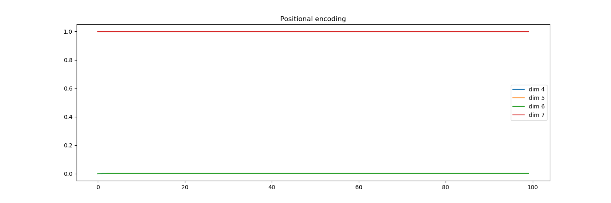

这个 PositionalEncoding 类实现了 Transformer 中的位置编码（Positional Encoding），用于为输入序列注入位置信息（因为 Transformer 本身没有递归或卷积结构，无法感知 token 的顺序）。以下是逐行解析：

1. 初始化方法 __init__

def __init__(self, d_model: int, dropout_prob: float, max_len: int = 5000):
    super().__init__()
    self.dropout = nn.Dropout(dropout_prob)
    self.register_buffer('positional_encodings', get_positional_encoding(d_model, max_len), False)
参数说明：
d_model：模型的嵌入维度（每个 token 的向量维度）。
dropout_prob：Dropout 的概率（用于正则化）。
max_len：预生成位置编码的最大序列长度（默认 5000，足够长以覆盖大多数任务）。
关键操作：
注册缓冲区 positional_encodings：
调用 get_positional_encoding(d_model, max_len) 生成形状为 (max_len, d_model) 的位置编码矩阵。
通过 register_buffer 将其保存为模型的非可学习参数（不参与梯度更新，但会随模型保存/加载）。
Dropout 层：用于在训练时随机丢弃部分位置编码信息（防止过拟合）。
2. 前向传播 forward

def forward(self, x: torch.Tensor):
    pe = self.positional_encodings[:x.shape[0]].detach().requires_grad_(False)
    x = x + pe
    x = self.dropout(x)
    return x
输入 x：形状为 (seq_len, batch_size, d_model) 的嵌入向量序列。
步骤解析：
截取位置编码：
pe = self.positional_encodings[:x.shape[0]]：根据当前输入序列长度 seq_len，从预生成的编码矩阵中截取对应部分（形状变为 (seq_len, d_model)）。
.detach().requires_grad_(False)：确保位置编码不参与梯度计算（仅作为固定信号）。
添加位置信息：
x = x + pe：将位置编码直接加到输入嵌入上（广播机制会自动处理 batch_size 维度）。
Dropout：
对加码后的结果进行随机丢弃（训练时生效，测试时关闭）。
3. 位置编码生成函数 get_positional_encoding
（假设该函数在外部定义，未在代码中展示，但通常实现如下：）

def get_positional_encoding(d_model: int, max_len: int):
    position = torch.arange(max_len).unsqueeze(1)  # (max_len, 1)
    div_term = torch.exp(torch.arange(0, d_model, 2) * (-math.log(10000.0) / d_model))
    pe = torch.zeros(max_len, d_model)
    pe[:, 0::2] = torch.sin(position * div_term)  # 偶数维度用 sin
    pe[:, 1::2] = torch.cos(position * div_term)  # 奇数维度用 cos
    return pe  # (max_len, d_model)
公式：
PE(pos,2i)=sin(10000 2i/d model pos),PE(pos,2i+1)=cos(10000 2i/d model pos)
pos：token 在序列中的位置。
i：嵌入维度的索引。
特性：
不同位置有唯一编码，且编码值在 [-1, 1] 范围内。
通过正弦和余弦函数的组合，模型可以学习到相对位置关系（如线性偏移可通过线性变换表示）。
4. 为什么需要位置编码？
Transformer 的局限性：自注意力机制是排列不变的（Permutation-Invariant），无法区分 [A, B, C] 和 [B, A, C]。
解决方案：显式注入位置信息，使模型感知 token 的顺序。
5. 关键设计细节
固定编码 vs 可学习编码：
此处使用固定的正弦/余弦编码（原始论文方案），优点是能泛化到比训练更长的序列。
某些实现（如 BERT）使用可学习的位置嵌入（nn.Embedding），更适合数据分布已知的任务。
Dropout 的作用：
防止模型过度依赖位置信息（尤其在数据量小时）。
缓冲区注册：
register_buffer 确保位置编码矩阵随模型保存/加载，且不参与优化。
6. 使用示例

d_model = 512
max_len = 100
dropout_prob = 0.1

pe = PositionalEncoding(d_model, dropout_prob, max_len)
x = torch.randn(10, 32, d_model)  # (seq_len=10, batch_size=32, d_model)
x_with_pos = pe(x)  # 添加位置编码
总结
功能：为输入序列添加位置信息，弥补 Transformer 的排列不变性缺陷。
核心公式：正弦/余弦交替生成编码，确保位置敏感性和可扩展性。
工程优化：通过缓冲区注册和 Dropout 提升稳定性和泛化性。

2.get_positional_encoding函数

这段代码实现了 Transformer 中的位置编码（Positional Encoding），用于为输入序列的每个位置生成独特的编码向量，从而让模型感知 token 的顺序信息。以下是逐行解析：

函数定义

def get_positional_encoding(d_model: int, max_len: int = 5000):
参数：
d_model：嵌入向量的维度（如 512）。
max_len：预生成位置编码的最大序列长度（默认 5000）。
1. 初始化编码矩阵

encodings = torch.zeros(max_len, d_model)
创建一个形状为 (max_len, d_model) 的全零矩阵，用于存储所有位置的位置编码。
2. 生成位置索引

position = torch.arange(0, max_len, dtype=torch.float32).unsqueeze(1)
position 形状：(max_len, 1)，值为 [0, 1, 2, ..., max_len-1]。
unsqueeze(1) 增加一个维度，便于后续广播计算。
3. 计算频率因子

two_i = torch.arange(0, d_model, 2, dtype=torch.float32)
div_term = torch.exp(two_i * -(math.log(10000.0) / d_model))
two_i：生成偶数索引 [0, 2, 4, ..., d_model-2]，形状为 (d_model//2,)。
div_term：计算频率因子，公式为： 10000 2i/d model
1 通过取对数并指数化实现高效计算。
形状：(d_model//2,)。
4. 生成正弦和余弦编码

encodings[:, 0::2] = torch.sin(position * div_term)  # 偶数维度：sin
encodings[:, 1::2] = torch.cos(position * div_term)  # 奇数维度：cos
偶数维度（0, 2, 4...）：使用 sin 函数。
奇数维度（1, 3, 5...）：使用 cos 函数。
广播机制：
position（形状 (max_len, 1)）与 div_term（形状 (d_model//2,)）相乘后，结果形状为 (max_len, d_model//2)。
通过切片 0::2 和 1::2 分别填充到编码矩阵的偶数和奇数维度。
5. 添加批次维度

encodings = encodings.unsqueeze(1).requires_grad_(False)
unsqueeze(1)：将形状从 (max_len, d_model) 变为 (max_len, 1, d_model)，以便与输入张量 (seq_len, batch_size, d_model) 广播相加。
requires_grad_(False)：禁用梯度计算（位置编码是固定的，不参与训练）。
6. 返回位置编码

return encodings
最终返回的形状：(max_len, 1, d_model)。
位置编码公式
函数实现的数学公式来自 Transformer 原始论文：
PE(pos,2i)=sin(10000 2i/d model pos),PE(pos,2i+1)=cos(10000 2i/d model pos)pos：token 的位置（0 到 max_len-1）。 i：维度索引（0 到 d_model/2-1）。
为什么需要位置编码？
Transformer 的局限性：自注意力机制是排列不变的（无法区分 [A, B, C] 和 [B, A, C]）。
解决方案：通过正弦和余弦函数的组合，模型可以学习到：
绝对位置信息（每个位置有唯一编码）。
相对位置信息（线性变换可表示位置偏移）。

3.测试当前模块函数_test_positional_encoding()
这段代码定义了一个测试函数 _test_positional_encoding()，用于可视化位置编码（Positional Encoding）的特性。以下是逐步解析：

1. 导入依赖

import matplotlib.pyplot as plt
使用 matplotlib 绘制位置编码的曲线图。
2. 创建画布

plt.figure(figsize=(15, 5))
设置画布大小为 15x5 英寸，便于展示长序列的编码趋势。
3. 生成位置编码

pe = get_positional_encoding(20, 100)
调用 get_positional_encoding(d_model=20, max_len=100)：
d_model=20：嵌入维度为 20（简化演示）。
max_len=100：生成 100 个位置的位置编码。
返回的 pe 形状为 (100, 1, 20)（max_len, batch=1, d_model）。
4. 可视化特定维度

plt.plot(np.arange(100), pe[:, 0, 4:8].numpy())
X 轴：位置索引 0 到 99（np.arange(100)）。
Y 轴：选取 pe 中第 0 个批次（因 batch=1），维度 4 到 7（4:8）的编码值。
共绘制 4 条曲线，对应维度 4、5、6、7。
.numpy() 将 PyTorch 张量转为 NumPy 数组。

5. 添加图例和标题
plt.legend(["dim %d" % p for p in [4, 5, 6, 7]])
plt.title("Positional encoding")
图例：标注每条曲线对应的维度（如 dim 4）。
标题：设为 "Positional encoding"。
6. 显示图像
plt.show()
弹出窗口展示可视化结果。
预期输出
生成的图像会显示 不同位置（X 轴） 在 特定维度（Y 轴） 上的编码值变化：

正弦和余弦交替：
偶数维度（如 4、6）使用 sin 函数，呈现波动。
奇数维度（如 5、7）使用 cos 函数，相位与相邻偶数维度不同。
波长多样性：
不同维度的频率不同（由 div_term 控制），低维度（如 4）变化快，高维度（如 7）变化慢。
测试目的
验证正确性：检查生成的编码是否符合正弦/余弦交替的预期模式。
直观理解：观察位置编码如何通过不同频率的组合捕捉位置信息。

二、Encoders_and_Decoder模块代码解释

1、EmbeddingsWithPositionalEncoding类解释

这个 EmbeddingsWithPositionalEncoding 类结合了 词嵌入（Word Embeddings） 和 位置编码（Positional Encoding），是 Transformer 模型的输入预处理层。以下是详细解析：

1. 初始化方法 __init__

def __init__(self, d_model: int, n_vocab: int, max_len: int = 5000):
    super().__init__()
    self.linear = nn.Embedding(n_vocab, d_model)  # 词嵌入层
    self.d_model = d_model  # 嵌入维度
    self.register_buffer('positional_encodings', get_positional_encoding(d_model, max_len))
参数：
d_model：嵌入向量的维度（如 512）。
n_vocab：词汇表大小。
max_len：预生成位置编码的最大序列长度（默认 5000）。
关键操作：
词嵌入层：nn.Embedding 将输入的 token ID 映射为 d_model 维向量。
位置编码：
调用 get_positional_encoding 生成形状为 (max_len, 1, d_model) 的编码矩阵。
通过 register_buffer 注册为模型的固定参数（不参与梯度更新，但会随模型保存/加载）。
2. 前向传播 forward

def forward(self, x: torch.Tensor):
    pe = self.positional_encodings[:x.shape[0]].requires_grad_(False)  # 截取位置编码
    return self.linear(x) * math.sqrt(self.d_model) + pe  # 缩放词嵌入并添加位置编码
输入 x：形状为 (seq_len, batch_size) 的 token ID 序列。
步骤解析：
截取位置编码：
pe = self.positional_encodings[:x.shape[0]]：根据当前序列长度 seq_len 截取编码，形状变为 (seq_len, 1, d_model)。
requires_grad_(False)：确保位置编码不参与梯度计算。
词嵌入与缩放：
self.linear(x)：将 token ID 映射为词嵌入，形状 (seq_len, batch_size, d_model)。
* math.sqrt(self.d_model)：缩放词嵌入（Transformer 的原始论文设计，避免嵌入值过小）。
添加位置信息：
+ pe：将位置编码广播加到词嵌入上（pe 会自动广播到 batch_size 维度）。
3. 关键设计解析
(1) 词嵌入缩放
为什么缩放？
原始 Transformer 论文中，词嵌入的初始值较小（均值为 0，方差为 1），而位置编码的值范围在 [-1, 1]。通过乘以 sqrt(d_model)，可以：
平衡词嵌入和位置编码的数值量级。
确保两者对模型输入的贡献相当。
(2) 位置编码广播
pe 的形状为 (seq_len, 1, d_model)，与词嵌入 (seq_len, batch_size, d_model) 相加时：
1 会自动广播到 batch_size 维度。
每个批次中的样本共享相同的位置编码（合理，因为位置信息与具体样本无关）。
(3) 梯度控制
位置编码 pe 通过 requires_grad_(False) 固定，仅词嵌入层参与训练。
4. 使用示例

d_model = 512
n_vocab = 10000  # 假设词汇表大小为 10k
max_len = 100

embedding_layer = EmbeddingsWithPositionalEncoding(d_model, n_vocab, max_len)
x = torch.randint(0, n_vocab, (10, 32))  # 随机生成 (seq_len=10, batch_size=32) 的 token ID
output = embedding_layer(x)  # 形状: (10, 32, 512)

2.TransformerLayer类
这个 TransformerLayer 类实现了一个标准的 Transformer 层，可以同时支持编码器和解码器。以下是详细解析：

1. 初始化方法 __init__

def __init__(self, *,
             d_model: int,
             self_attn: MultiHeadAttention,
             src_attn: MultiHeadAttention = None,
             feed_forward: FeedForward,
             dropout_prob: float):
参数说明：
d_model：输入输出的向量维度（如 512）。
self_attn：自注意力模块（MultiHeadAttention 实例）。
src_attn：源注意力模块（解码器中用于关注编码器输出，编码器中为 None）。
feed_forward：前馈网络模块（FeedForward 实例）。
dropout_prob：Dropout 概率。
2. 关键组件

self.size = d_model
self.self_attn = self_attn          # 自注意力
self.src_attn = src_attn            # 源注意力（解码器专用）
self.feed_forward = feed_forward    # 前馈网络
self.dropout = nn.Dropout(dropout_prob)
self.norm_self_attn = nn.LayerNorm([d_model])  # 自注意力前的归一化
if self.src_attn is not None:
    self.norm_src_attn = nn.LayerNorm([d_model])  # 源注意力前的归一化
self.norm_ff = nn.LayerNorm([d_model])           # 前馈网络前的归一化
Layer Normalization：每个子层（自注意力、源注意力、前馈网络）前均进行归一化。
Dropout：用于注意力输出和前馈网络输出的正则化。
3. 前向传播 forward
(1) 自注意力处理

z = self.norm_self_attn(x)                          # 归一化
self_attn = self.self_attn(query=z, key=z, value=z, mask=mask)  # 自注意力计算
x = x + self.dropout(self_attn)                    # 残差连接 + Dropout
自注意力：query、key、value 均来自输入 x（因此称为“自”注意力）。
残差连接：保留原始输入信息，缓解梯度消失。
(2) 源注意力处理（解码器专用）

if src is not None:
    z = self.norm_src_attn(x)                      # 归一化
    attn_src = self.src_attn(query=z, key=src, value=src, mask=src_mask)  # 关注编码器输出
    x = x + self.dropout(attn_src)                # 残差连接 + Dropout
源注意力：query 来自解码器输入，key 和 value 来自编码器输出（src）。
掩码：src_mask 用于屏蔽编码器的填充位置（如 PAD）。
(3) 前馈网络处理

z = self.norm_ff(x)                                # 归一化
if self.is_save_ff_input:
    self.ff_input = z.clone()                      # 可选：保存前馈输入（调试用）
ff = self.feed_forward(z)                         # 前馈网络计算
x = x + self.dropout(ff)                          # 残差连接 + Dropout
前馈网络：通常由两个线性层和激活函数组成（如 ReLU）。
调试支持：通过 is_save_ff_input 可保存中间结果。
4. 设计亮点
模块化设计：
自注意力、源注意力、前馈网络均通过外部传入，提高灵活性。
Pre-LayerNorm：
在每层计算前进行归一化（与原始 Transformer 的 Post-LN 不同），训练更稳定。
残差连接：
每个子层输出均与输入相加，保留原始信息。
解码器支持：
通过 src_attn 实现编码器-解码器注意力机制。

3.Encoder编码器类

这个 Encoder 类实现了一个完整的 Transformer 编码器，通过堆叠多个相同的 TransformerLayer 构成。以下是详细解析：

1. 初始化方法 __init__

def __init__(self, layer, n_layers):
    super().__init__()
    self.layers = clone_model_list(layer, n_layers)  # 克隆多层
    self.norm = nn.LayerNorm([layer.size])           # 最终层归一化
参数：
layer：一个 TransformerLayer 实例（模板层）。
n_layers：编码器的层数（如 6 层）。
关键操作：
克隆多层：
clone_model_list 会深度复制 layer n_layers 次（确保各层参数独立）。
最终归一化：
在所有层后添加一个 LayerNorm，稳定输出。
2. 前向传播 forward

def forward(self, x, mask):
    for layer in self.layers:  # 逐层处理
        x = layer(x=x, mask=mask)
    x = self.norm(x)          # 最终归一化
    return x
输入：
x：形状为 (seq_len, batch_size, d_model) 的嵌入向量。
mask：形状为 (batch_size, seq_len, seq_len) 的注意力掩码（屏蔽 PAD 等无效位置）。
流程：
逐层传递：
每层进行自注意力 + 前馈网络计算（见 TransformerLayer 解析）。
输出归一化：
对所有层的输出做最终归一化。

4.Decoder解码器类
这个 Decoder 类实现了一个完整的 Transformer 解码器，通过堆叠多个 TransformerLayer 构成，支持自注意力和编码器-解码器注意力机制。以下是详细解析：

1. 初始化方法 __init__

def __init__(self, layer, n_layers):
    super().__init__()
    self.layers = clone_module_list(layer, n_layers)  # 克隆多层
    self.norm = nn.LayerNorm([layer.size])            # 最终层归一化
参数：
layer：一个 TransformerLayer 实例（模板层，需包含 src_attn）。
n_layers：解码器的层数（如 6 层）。
关键操作：
克隆多层：
clone_module_list 深度复制 layer，确保各层参数独立。
最终归一化：
在所有层后添加 LayerNorm，稳定输出。
2. 前向传播 forward

def forward(self, x, memory, src_mask, tgt_mask):
    for layer in self.layers:
        x = layer(x=x, mask=tgt_mask, src=memory, src_mask=src_mask)
    return self.norm(x)
输入：
x：解码器输入，形状为 (tgt_seq_len, batch_size, d_model)。
memory：编码器输出（来自 Encoder），形状为 (src_seq_len, batch_size, d_model)。
src_mask：编码器输出的掩码，形状为 (batch_size, src_seq_len)。
tgt_mask：解码器输入的掩码，形状为 (batch_size, tgt_seq_len, tgt_seq_len)（通常含因果掩码）。
流程：
逐层处理：
每层依次执行：
自注意力（mask=tgt_mask，屏蔽未来 token）。
编码器-解码器注意力（src=memory，关注编码器输出）。
前馈网络。
每层内部包含残差连接和归一化。
输出归一化：
对所有层的结果做最终归一化。

5.组合编码器和解码器
这个 EncoderDecoder 类实现了完整的 Transformer 序列到序列模型，整合了编码器、解码器、嵌入层和生成器。以下是详细解析：

1. 初始化方法 __init__

def __init__(self, encoder: Encoder, decoder: Decoder, 
             src_embed: nn.Module, tgt_embed: nn.Module, 
             generator: nn.Module):
    super().__init__()
    self.encoder = encoder      # 编码器模块
    self.decoder = decoder      # 解码器模块
    self.src_embed = src_embed  # 源序列嵌入层
    self.tgt_embed = tgt_embed  # 目标序列嵌入层
    self.generator = generator  # 输出生成器（通常为线性层 + Softmax）

    # Xavier/Glorot 初始化
    for p in self.parameters():
        if p.dim() > 1:
            nn.init.xavier_uniform_(p)
关键组件：
encoder：Encoder 实例，处理源序列（如编码器堆叠层）。
decoder：Decoder 实例，生成目标序列并关注编码器输出。
src_embed/tgt_embed：嵌入层（通常为 EmbeddingsWithPositionalEncoding）。
generator：将解码器输出映射到词汇表分布（如 nn.Linear(d_model, vocab_size)）。
参数初始化：
对所有维度大于 1 的参数使用 Xavier 均匀初始化（Glorot 初始化），确保训练稳定性。
2. 前向传播 forward

def forward(self, src: torch.Tensor, tgt: torch.Tensor, 
            src_mask: torch.Tensor, tgt_mask: torch.Tensor):
    enc = self.encode(src, src_mask)                     # 编码源序列
    return self.decode(enc, src_mask, tgt, tgt_mask)      # 解码生成目标序列
输入：
src：源序列 token ID，形状为 (src_seq_len, batch_size)。
tgt：目标序列 token ID，形状为 (tgt_seq_len, batch_size)。
src_mask：源序列掩码，形状为 (batch_size, src_seq_len)。
tgt_mask：目标序列掩码，形状为 (batch_size, tgt_seq_len, tgt_seq_len)（含因果掩码）。
流程：
编码：self.encode(src, src_mask) → 生成编码器输出 memory。
解码：self.decode(memory, src_mask, tgt, tgt_mask) → 生成目标序列表示。
3. 编码与解码方法
(1) 编码 encode

def encode(self, src: torch.Tensor, src_mask: torch.Tensor):
    return self.encoder(self.src_embed(src), src_mask)
步骤：
源序列嵌入：self.src_embed(src) 将 token ID 转换为嵌入向量 + 位置编码，形状变为 (src_seq_len, batch_size, d_model)。
编码器处理：self.encoder 对嵌入向量进行多层自注意力计算，输出 memory（形状同输入）。
(2) 解码 decode

def decode(self, memory: torch.Tensor, src_mask: torch.Tensor, 
           tgt: torch.Tensor, tgt_mask: torch.Tensor):
    return self.decoder(self.tgt_embed(tgt), memory, src_mask, tgt_mask)
步骤：
目标序列嵌入：self.tgt_embed(tgt) 生成目标序列嵌入 + 位置编码，形状为 (tgt_seq_len, batch_size, d_model)。
解码器处理：self.decoder 结合目标嵌入和编码器输出 memory，通过自注意力和编码器-解码器注意力生成输出。
4. 生成器

def generate(self, decoder_output: torch.Tensor):
    return self.generator(decoder_output)  # 形状: (seq_len, batch_size, vocab_size)
功能：将解码器输出的 d_model 维向量映射到词汇表分布（通过线性层 + Softmax）。

四、总结

